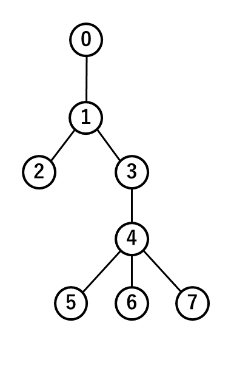

# dfs-elementary-sample
DFSを理解するための超初心者向けサンプルプログラム

## sample1.c
### 問題設定
箱0, 1, 2，…，7がある．  
目標は数値xがある箱を見つけること．  
あなたは初めに箱0を開ける．  
箱 i 中に入っている数字の値はa[i]である．  
箱 i を開けた後，その中の数値a[i]がxではなかったとき，箱を開け直す．  
箱 i の次は後は箱a[i]を開ける．  

## sample2.c
### 問題設定
こんなグラフがある．  
